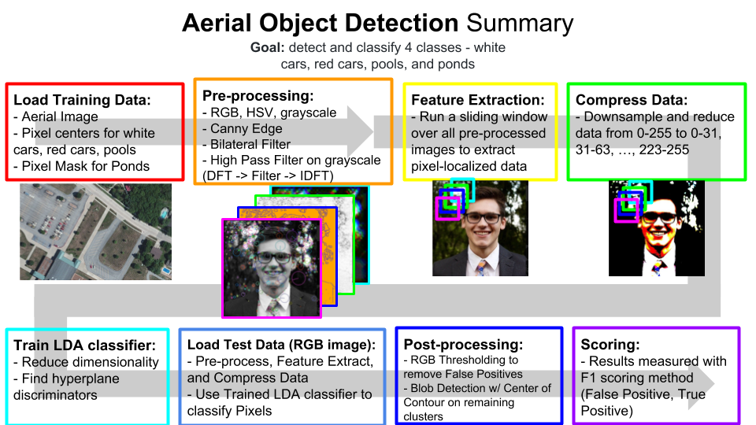
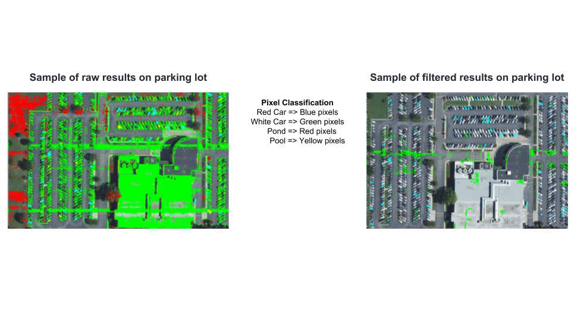

## EEL4930: Introduction to Machine Learning ##
---
### Final Project Notes ###

__Training Data__: RGB satellite images from DigitalGlobe Database over Columbia, Missouri

__Goal__: detect and classify 4 classes - white cars, red cars, (blue) pools, and (green) ponds

__Development__: preprocessing, feature extraction, model choice, evaluation, and parameter tuning

__Final Scoring Metrics__: F-Score (refer to class notes 3/15)

[Project PDF][ref-id-PDF]

[ref-id-PDF]: https://github.com/dean4ta/ML-aerial-object-detection/blob/master/project/IndentationError.pdf

